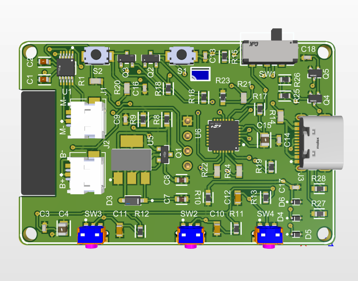

# :watch: TapBand -- MQTT IoT Wearable Device (In Mass Production)


A compact **5cm x 3cm** battery-powered wearable IoT device with MQTT real-time communication, OLED display, WS2812B LEDs, vibration motor, and deep-sleep power optimization. Built for a commercial security application for an Ireland-based startup -- **currently in mass production**.

> See also: [TapBand Web Dashboard](https://github.com/zaeem7744/TapBand-Web-Dashboard)

---

## :camera: PCB Design (Altium Designer)

### Front -- ESP32 Module + OLED Display
Custom-designed compact PCB featuring ESP32 Wi-Fi/BLE module and SSD1306 OLED display.

.png)

### Back -- Full Component Layout
Battery connector, USB charging, 4 navigation buttons (SW1-SW4), vibration motor driver, WS2812B LED driver, and SMD power management.



### PCB Layout -- Altium Designer
Multi-layer PCB routing optimized for compact form factor and RF performance.


---

## :zap: Key Highlights

- **Ultra-Compact: 5cm x 3cm** -- production-optimized PCB designed in Altium Designer
- **Currently in mass production** for commercial security applications
- **MQTT real-time communication** via HiveMQ Cloud broker
- **Deep-sleep optimization** for extended battery life
- **Wi-Fi provisioning** -- hotspot-based setup, no hardcoded credentials
- **Custom PCB with Gerber files** -- production-ready design
- **Full ecosystem** -- firmware + PCB + web dashboard + Flask backend

---

## :wrench: Features

| Feature | Description |
|---------|-------------|
| **OLED Display** | SSD1306 menu-driven interface with navigation buttons |
| **MQTT Communication** | Bidirectional real-time messaging via HiveMQ Cloud |
| **Deep Sleep** | Aggressive power saving for battery longevity |
| **Wi-Fi Provisioning** | Hotspot-based initial setup |
| **WS2812B LEDs** | Addressable RGB LED indicators for visual alerts |
| **Vibration Motor** | Haptic feedback for notifications |
| **4 Navigation Buttons** | Physical UI for menu navigation and actions |
| **USB Charging** | Micro-USB/USB-C connector for battery charging |
| **Admin Dashboard** | Real-time subscription management via web panel |
| **Flask Backend** | Server-side MQTT relay and device management |

---

## :file_folder: Project Structure

```
TapBand-Firmware-and-PCB/
|-- TapBand_Main/              # Main production firmware
|-- TapBand_Design/            # Altium Designer PCB project files
|-- Documents/                 # PCB renders, screenshots, schematics
|-- MQTT/                      # MQTT communication module
|-- OLED_MQTT/                 # OLED + MQTT integration
|-- OLED_INTERFAACE/           # OLED display driver
|-- WIFI_PROVISIONIG_MQTT_OLED/ # Wi-Fi provisioning system
|-- PowerSave_AlertBand_Test/  # Deep-sleep power profiling
|-- WS2812_Test/               # LED strip testing
|-- Board_Vibrator_Test/       # Vibration motor testing
|-- Sync_Mqtt_Hive/            # HiveMQ broker sync module
+-- Web App/                   # Flask backend + MQTT dashboard
    |-- mqtt_dashboard/        # Real-time MQTT monitoring
    +-- tapband_server/        # Flask backend for device management
```

---

## :hammer_and_wrench: Tech Stack

| Component | Technology |
|-----------|-----------|
| **MCU** | ESP32 (Espressif Systems) |
| **Language** | C/C++ (PlatformIO) |
| **Communication** | MQTT (HiveMQ Cloud), Wi-Fi |
| **Display** | SSD1306 OLED (I2C) |
| **LEDs** | WS2812B addressable RGB |
| **PCB Design** | Altium Designer |
| **Backend** | Flask (Python) + MQTT relay |
| **Dashboard** | [React + TypeScript](https://github.com/zaeem7744/TapBand-Web-Dashboard) |
| **Power** | LiPo battery + deep-sleep optimization |

---

## :bust_in_silhouette: Author

**Muhammad Zaeem Sarfraz** -- Electronics & IoT Hardware Engineer

- :link: [LinkedIn](https://www.linkedin.com/in/zaeemsarfraz7744/)
- :email: Zaeem.7744@gmail.com
- :earth_africa: Vaasa, Finland
